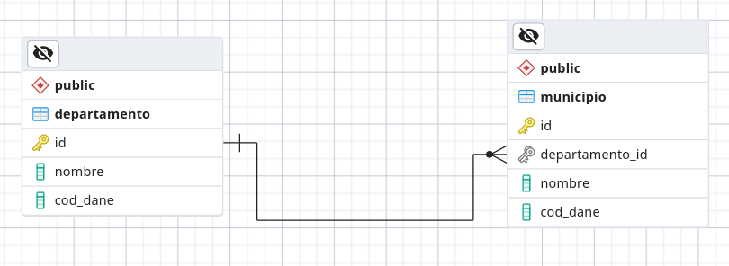

# SQL / JSON Código DANE Departamentos y Municipios de Colombia 2023
Códigos DANE de municipios y departamentos de Colombia JSON/SQL

## Fuente
Los datos aquí presentes fueron tomados de la plataforma nacional [Datos Abiertos Colombia](https://www.datos.gov.co/Mapas-Nacionales/Departamentos-y-municipios-de-Colombia/xdk5-pm3f) actualización de `15 de julio de 2022` y comparados, con los datos de [SOCIAL.COM.CO](https://www.social.com.co/codigo-dane-municipios/) en fecha de `07 de agosto de 2023`, para su posterior limpieza y depuración de datos.

## USO
En el archivo `src/main.js` se encuentra lo necesario para crear los scripts de base de datos, solo necesita cambiar la sintaxis de su motor de base de datos preferido, por defecto se usó la sintaxis de `Postgres SQL` con el siguiente esquema:



Para generar los script debe tener instalado [`Node.js`](https://nodejs.org/es/download) y ejecutar el siguiente comando:

```bash
node src/main.js
```

Los queries se guardarán en la carpeta `scripts`. También si desea puede modificar la data original almacenada en el archivo `resources/source_data.json`.


## Esquema
### Tabla: Departamento

| Campo      | Tipo        | Descripción                  |
|------------|-------------|------------------------------|
| id         | INT         | ID auto-incremental          |
| nombre     | VARCHAR(56) | Nombre del departamento      |
| cod_dane   | CHAR(2)     | Código DANE del departamento |

### Tabla: Municipio

| Campo           | Tipo        | Descripción              |
|-----------------|-------------|--------------------------|
| id              | INT         | ID auto-incremental      |
| departamento_id | INT         | ID del departamento      |
| nombre          | VARCHAR(27) | Nombre del municipio     |
| cod_dane        | CHAR(5)     | Código DANE del municipio|
